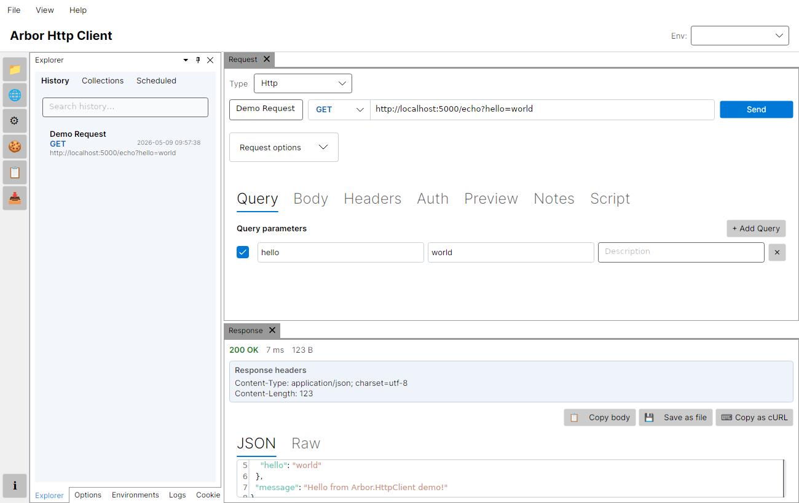
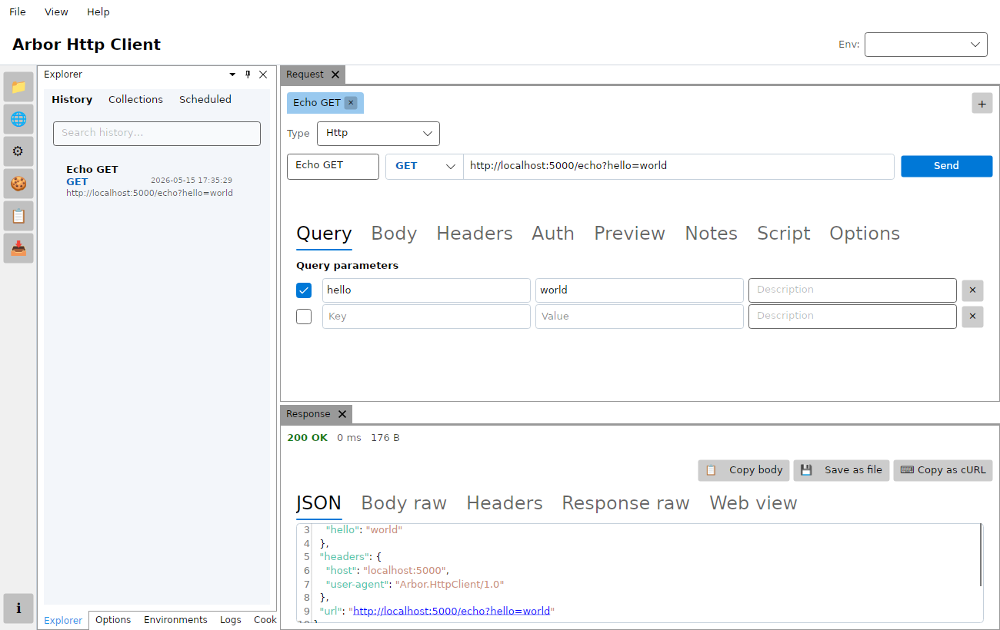
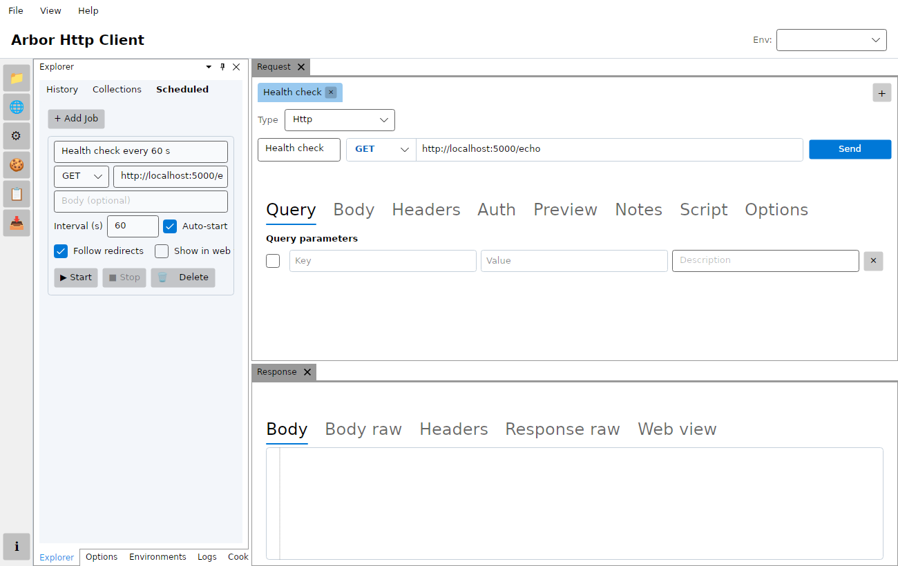

# Arbor.HttpClient

Cross-platform desktop HTTP client built with **.NET 10**, **Avalonia 12**, and **SQLite**.

## Demo

<video src="docs/demo.mp4" controls width="100%"></video>

[](docs/demo.mp4)

*Click the image above or [download docs/demo.mp4](docs/demo.mp4) to watch the demo.*

## Screenshots



*Main window – send a request and inspect the response.*


*Environment panel – define reusable variables and apply them across requests.*



*Scheduled jobs – run any saved request on a repeating interval in the background.*

## Solution layout

- `Arbor.HttpClient.slnx` (SLNX solution at repo root)
- `src/Arbor.HttpClient.Core` - UI-agnostic business logic for sending requests and storing history
- `src/Arbor.HttpClient.Storage.Sqlite` - SQLite implementation of request history storage
- `src/Arbor.HttpClient.Desktop` - Avalonia desktop UI app (Windows/Linux/macOS)
- `src/Arbor.HttpClient.Core.Tests` - xUnit + AwesomeAssertions unit tests
- `src/Arbor.HttpClient.Desktop.E2E.Tests` - headless UI automation tests

## Run

```bash
dotnet run --project src/Arbor.HttpClient.Desktop/Arbor.HttpClient.Desktop.csproj
```

## Test

```bash
dotnet test Arbor.HttpClient.slnx
```

## Using Variables

Variables let you reuse values across requests without hard-coding them.  
They are referenced with double curly braces: **`{{variableName}}`**.

### 1 – Create an environment

1. Click **Manage Envs** in the top toolbar.
2. Click **+ New Environment**.
3. Enter an environment name (e.g. `Development` or `Production`).
4. Click **+ Add Variable** and fill in name/value pairs:

   | Name          | Example value                   |
   |---------------|---------------------------------|
   | `baseUrl`     | `https://postman-echo.com`      |
   | `token`       | `my-secret-api-token`           |
   | `apiVersion`  | `v2`                            |

5. Click **Save Environment**.

### 2 – Activate the environment

Select the environment from the **Env:** dropdown in the top toolbar.  
Every subsequent request will resolve variables using that environment's values.

### 3 – Reference variables in requests

Use `{{variableName}}` in the **URL**, **request body**, or any **header value**:

**URL**
```
{{baseUrl}}/get?version={{apiVersion}}
```

**Request body (JSON)**
```json
{
  "auth": "{{token}}",
  "version": "{{apiVersion}}"
}
```

**Header value**
```
Authorization: Bearer {{token}}
```

If a variable name has no match in the active environment it is left unchanged in the outgoing request.

## Scheduled Jobs

Any request can be scheduled to run automatically in the background:

1. Switch to the **Scheduled** tab in the left panel.
2. Click **+ Add Job** and fill in:
   - **Job name** – a friendly label for the log.
   - **Method / URL** – same fields as a normal request (variables are supported).
   - **Body** – optional request body.
   - **Interval (seconds)** – how often the request fires.
   - **Auto-start** – tick this to have the job start automatically when the app opens.
3. Click **Save**, then **▶ Start** to run the job immediately, or rely on auto-start.
4. Click **■ Stop** to pause a running job.

Global launch behavior can be controlled in **Options → HTTP → Auto-start scheduled jobs on launch**.  
If this option is disabled, no scheduled jobs are auto-started at application launch even when a job has **Auto-start** enabled.

Each invocation is recorded in the live log. Open it with the **📋 Logs** button in the toolbar.

## Live Log

The log window (**📋 Logs** toolbar button) shows all application events in real time:

- Each scheduled job invocation, including HTTP status code.
- Any errors (connection failures, invalid URLs, etc.).
- Up to **1 000** events are kept in memory; older events are discarded automatically.

## Design attribution

The theme palette and visual direction are inspired by [Hoppscotch](https://github.com/hoppscotch/hoppscotch).

## Regenerating Screenshots

To regenerate the documentation screenshots locally (no display required):

```bash
./scripts/take-screenshots.sh
```

Screenshots are written to `docs/screenshots/` and should be committed to the repository.

## Regenerating the Demo Video

To regenerate the demo video from the latest headless screenshots (no display required):

```bash
./scripts/record-demo.sh
```

The script requires `ffmpeg` and `python3` in addition to the .NET 10 SDK.
It regenerates the screenshots, assembles video segments with animated text overlays, and writes `docs/demo.mp4`.

